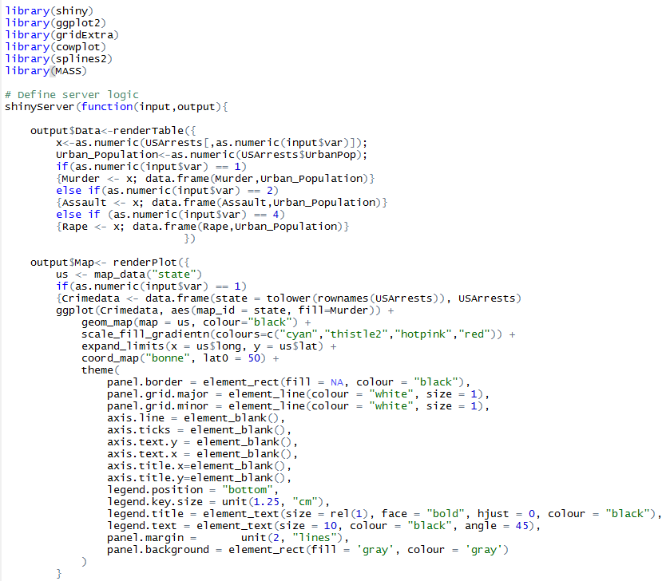

USArrests based shiny app on murder, assault and rape crime rates
========================================================
author: Riz
date: Mon Oct 03 15:07:12 2016
autosize: true
font-family: 'Helvetica'
transition: roate
transition-speed: fast


Introduction
========================================================

This peer assessed assignment has two parts. First, you will create a Shiny application and deploy it on Rstudio's servers. Second, you will use Slidify or Rstudio Presenter to prepare a reproducible pitch presentation about your application.

- <span style="font-weight; color:green;">For developing the shiny apps, the USArrests data set is considered and murdered, assault and rape features are analyzed.</span> 
- <span style="font-weight; color:green;">The developed Shiny App has 2 parts, a drop-down box which is on the left panel and a main panel on the right.</span> 
- <span style="font-weight; color:green;">The drop-down box facilitates the user to choose three different crime rates in the USA.</span> 
- <span style="font-weight; color:green;">Based on the selection in the drop-down menu, it is possible to see the associated data, map, regression plot and regression diagnostics on the tabs in the main panel on the right hand side.</span>

The next slide will give a picture of the app developed.

Screenshots of the app based on USArrests data set
========================================================
</img>

Code 
========================================================
For generating the data associated to the features from the USArrests data set, and for visualizing it on the US map based on the features, the following chunk of the code was used in server.R. Check ui.R and server.R for the complete set of code. 


Embedded R code 
========================================================
For example, when as.numeric(input$var) = 4, which represents Rape feature, the code for diagnostics and the plot are

```r
x<-as.numeric(USArrests[,4])
y<-as.numeric(USArrests$UrbanPop)
par(mfrow = c(2,3))
par(cex = 0.8)
lm.out = lm(y ~ x, data=USArrests)
plot(lm.out,col="blue")
plot(cooks.distance(lm.out),col="blue")
```


